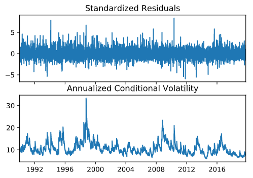
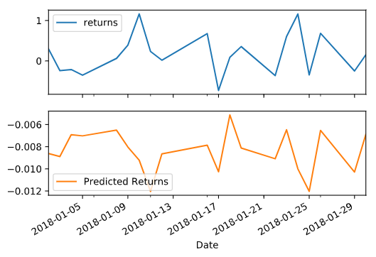

# Time_Series
## Time_series with ARMA, ARIMA, GARCH and Linear Regression

## Background

The financial departments of large companies often deal with foreign currency transactions while doing international business. As a result, they are always looking for anything that can help them better understand the future direction and risk of various currencies. Hedge funds, too, are keenly interested in anything that will give them a consistent edge in predicting currency movements.

We will test the many time-series tools in order to predict future movements in the value of the Japanese yen versus the U.S. dollar.

1. Time Series Forecasting
2. Linear Regression Modeling

#### Time-Series Forecasting

In this notebook, we load historical Dollar-Yen exchange rate futures data and apply time series analysis and modeling to determine whether there is any predictable behavior.

Following steps in the time-series notebook to complete the following:

1. Decomposition using a Hodrick-Prescott Filter (Decompose the Settle price into trend and noise).

2. Forecasting Returns using an ARMA Model.

Comments--The p-value is 0.421 >0.05 so the model is not a good fit. (In good-fit models, p-value <0.05. )
for ar L1 p-value is 0.810 and for ar L2 0.92 which is higher than 0.05, so ARMA is not a good fit model to use 2 lags

3. Forecasting the Settle Price using an ARIMA Model.

 *Comment:
 
<l> Here from the model we can see that the ar-L3 has a p-value of 0.302 and ar-L4 0.374 which is better than the ar-1 and ar-2. But the lags are still greater than 0.05. So still the ARIMA model doesnot seem to be a good fit*

4. Forecasting Volatility with GARCH.

Commemts:

<li>In the GARCH model, P-value  is 3.708e-02 which is lower than 0.05 so this is a good fit model.,Also the AIC is the lowest amongst the 3 models (ARMA, ARIMA and GARCH)*</li>

Use the results of the time series analysis and modeling to answer the following questions:

1. Based on your time series analysis, would you buy the yen now?
2. Is the risk of the yen expected to increase or decrease?
3. Based on the model evaluation, would you feel confident in using these models for trading?

Comments: 
 
<ol> 
<li>Returns as on the last_day (2019-10-15) is-0.469 and forecasted volitality for the next 5 days is increasing from 7.44 to 7.60</li> 
<li>So yen volitaliy is expected to increase in the next 5 days which means that the yen could rise or fall.</li>
<li>I would buy yen today if I know that it would be volatile in the next five days.</li> 
<li>Based on the ARIMA Settle price trend the prices are going to increase for the next 5 days. Hence, I would  make my decision to buy yen
</ol>

#### Linear Regression Forecasting

In this notebook, we will build a Scikit-Learn linear regression model to predict Yen futures ("settle") returns with *lagged* Yen futures returns and categorical calendar seasonal effects (e.g., day-of-week or week-of-year seasonal effects).

Following are the steps outlined in the regression_analysis notebook:

1. Data Preparation (Creating Returns and Lagged Returns and splitting the data into training and testing data)
2. Fitting a Linear Regression Model.
3. Making predictions using the testing data.
4. Out-of-sample performance.
5. In-sample performance.

Comments: 
 
<li>After running the linear regression model, we observe that the out-of-sample RMSE of 0.412  is lower than the in-sample RMSE of 0.596. This means that model predictions are only ~ 42% of the actuals.</li>
<li> The graph output also shows the same that the predicted returns line is not similar to the returns line</li>
<li> So the model performs *worse* than on out-of-sample data compared to in-sample data. 

