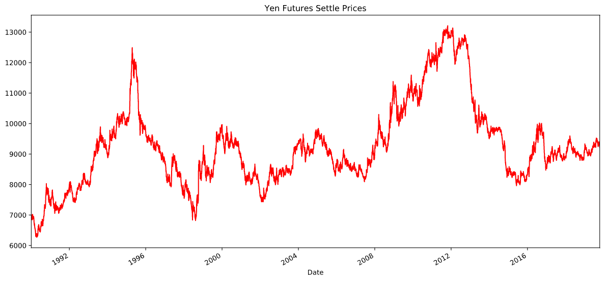
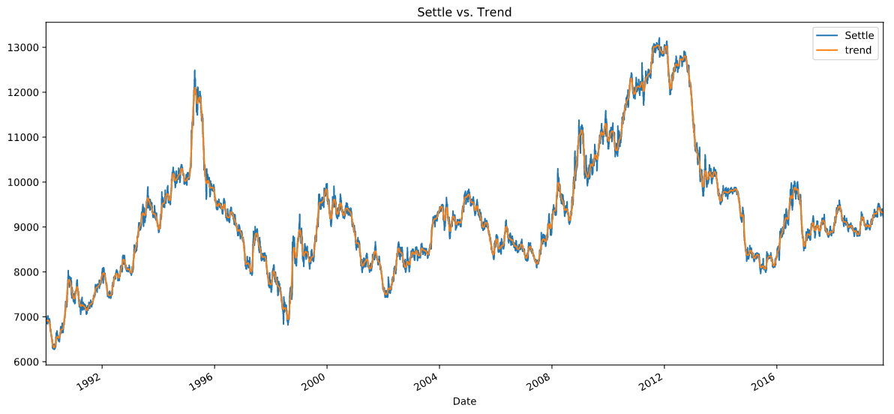
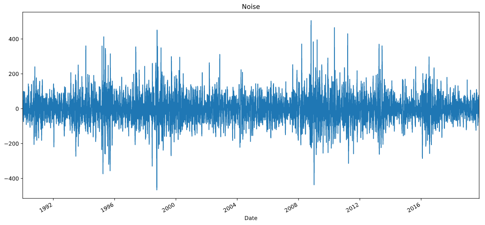
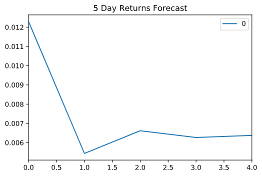
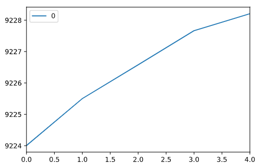
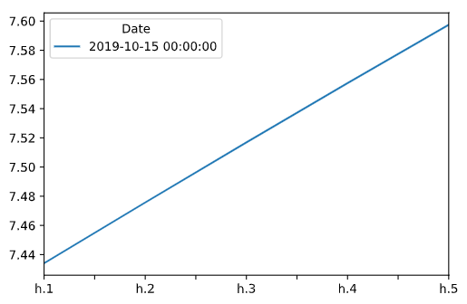

# Time_Series
## Time_series with ARMA, ARIMA, GARCH and Linear Regression

## Background

The financial departments of large companies often deal with foreign currency transactions while doing international business. As a result, they are always looking for anything that can help them better understand the future direction and risk of various currencies. Hedge funds, too, are keenly interested in anything that will give them a consistent edge in predicting currency movements.

We will test the many time-series tools in order to predict future movements in the value of the Japanese yen versus the U.S. dollar.

1. Time Series Forecasting
2. Linear Regression Modeling

#### Time-Series Forecasting

In this notebook, we load historical Dollar-Yen exchange rate futures data and apply time series analysis and modeling to determine whether there is any predictable behavior.

From the above chart we can see that the prices are stationary 

Following steps in the time-series notebook to complete the following:

1. Decomposition using a Hodrick-Prescott Filter (Decompose the Settle price into trend and noise).

2. Forecasting Returns using an ARMA Model.

We can use ARMA model to forecast the returns for tne next 5 days.

Comments--Based on the ARMA model summary , we can observe that the p-value is 0.421 >0.05 so the model is not likely to be a good fit. (In good-fit models, p-value <0.05. )
Further, for ar L1 p-value is 0.810 and for ar L2 0.92 which is higher than 0.05, so ARMA is not a good fit model to use 2 lags

3. Forecasting the Settle Price using an ARIMA Model.

 *Comment:
 
<l> Here we can see that the ar-L3 has a p-value of 0.302 and ar-L4 0.374 which is better than the ar-1 and ar-2. But the lags are still greater than 0.05. So still the ARIMA model doesnot seem to be a good fit*

4. Forecasting Volatility with GARCH.

Commemts:

<li>P-value  is 3.708e-02 which is lower than 0.05 so this is a good fit model.Also the AIC is the lowest amongst the 3 models (ARMA, ARIMA and GARCH)*</li>

Use the results of the time series analysis and modeling to answer the following questions:

1. Based on your time series analysis, would you buy the yen now?
2. Is the risk of the yen expected to increase or decrease?
3. Based on the model evaluation, would you feel confident in using these models for trading?

Comments: 
 
<ol> 
<li>Returns as on the last_day (2019-10-15) is-0.469 and forecasted volitality for the next 5 days is increasing from 7.44 to 7.60</li> 
<li>So yen volitaliy is expected to increase in the next 5 days.</li>
<li>I would buy yen today if I know that it would be volatile in the next five days.</li> 
<li>Based on the ARIMA Settle price trend the prices are going to increase for the next 5 days. Hence, I would  make my decision to buy yen
</ol>
